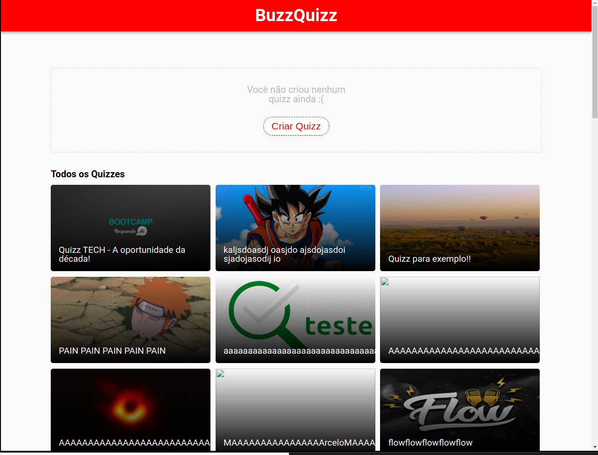
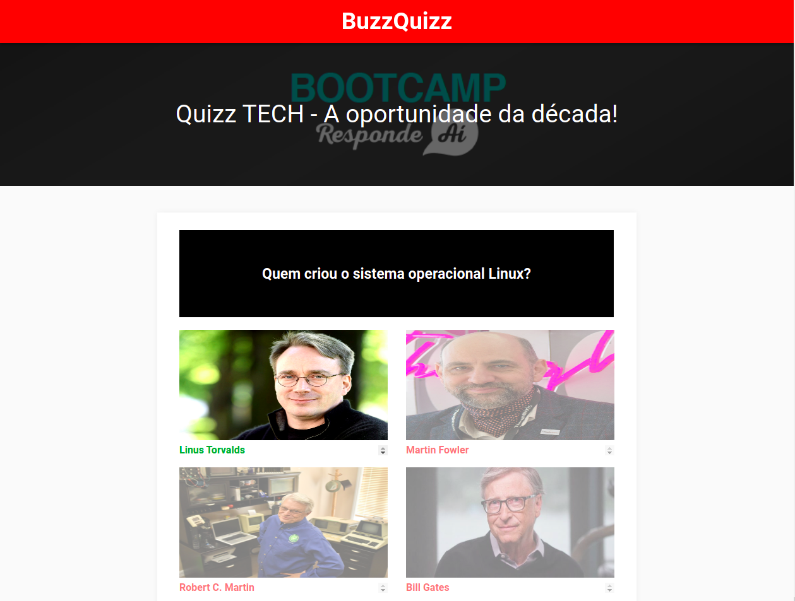
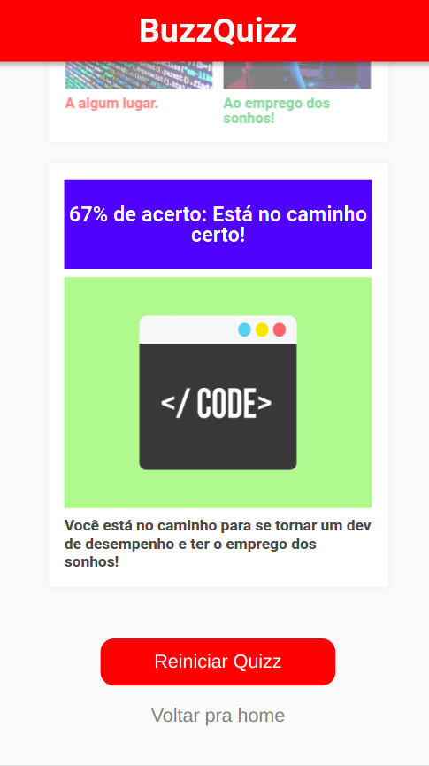
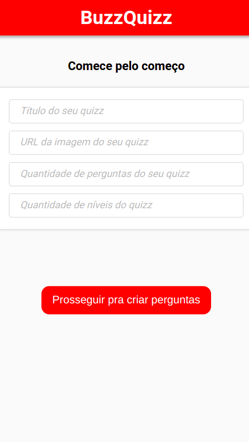

<h1 align="center">
    BuzzQuizz
</h1>

 

<h4 align="center"> 
	 Status: Entregue.
</h4>

## Sobre

Implementação de um sistema de Quizzes em HTML, CSS e JavaScript! Nesse sistema, fomos responsáveis por desenvolver tanto a experiência do Quizz em si, quanto as telas que permitem criar quizzes!

---

## Layout
### Desktop

  
  

### Mobile

  
  

## Tech Used

Foram usadas as seguintes ferramentas para o desenvolvimento do projeto:

- ****
- ****
- ****

#### **Utilities**

- Prototype: **[Figma](https://www.figma.com/)** → **[Protótipo (BuzzQuizz)](https://www.figma.com/file/nCuPD1re0r4EAwNl7OCNvz/BuzzQuizz---Turma-02?node-id=0%3A1)**
- Editor: **[Visual Studio Code](https://code.visualstudio.com/)**
- Fonts: **[Roboto](https://fonts.google.com/specimen/Roboto)**

---

## Authors

<a style="border-radius: 50px;" width="100px;" href="https://github.com/fevalani">
 
  
 <b>Fernando Valani</b></a>
  
 
<a style="border-radius: 50px;" width="100px;" href="https://github.com/yungtay">
 
  
 <b>Christian Yungtay</b></a>
  

## 

## License

👋🏽 Get in Touch!

---
